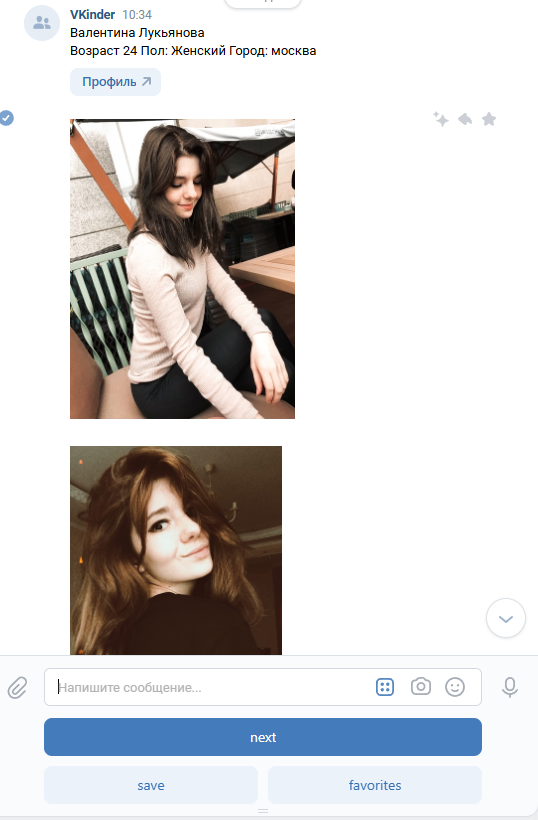

# adpy-team-diplom
Командный проект по курсу «Профессиональная работа с Python»

# VKinder
VK-Бот, предназначенный для знакомств. Бот подбирает людей, которые подходят под условия поиска (Город, Пол, Возраст)
Имеется возможность сохранить понравившихся людей в БД, выгрузить список понравившихся людей из БД, продолжить поиск, нажав кнопку next.

# Настройка
Для запуска и настройки бота необходимо предпринять следующие действия:

1. Скопировать репозиторий с помощью Git: git clone https://github.com/VladSychev1983/adpy-team-diplom.git
2. Установить зависимости, с помощью команды: pip install -r requirements.txt
3. Настроить файл конфигурации setting.yaml (ввести токен группы ВК, токен пользователя, настройки для работы БД PostgreSQL) 
4. Запустить на исполнение файл main.py

